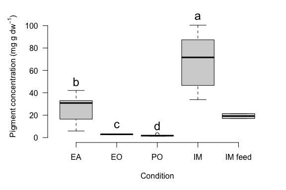
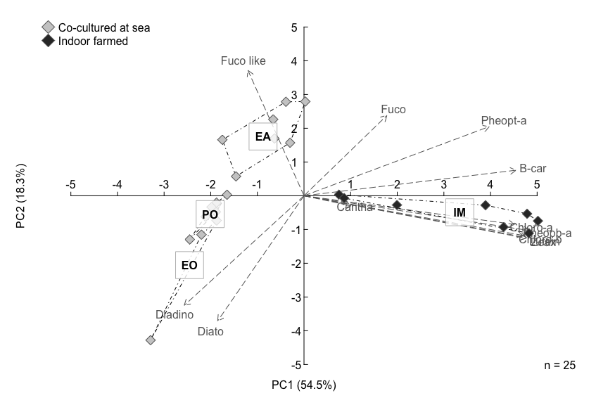
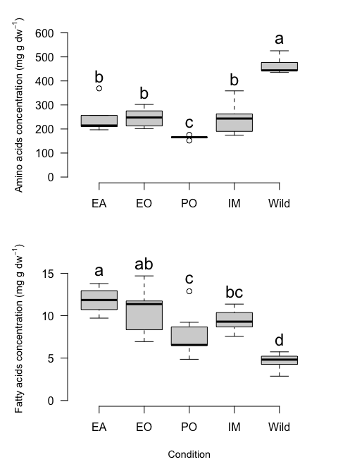
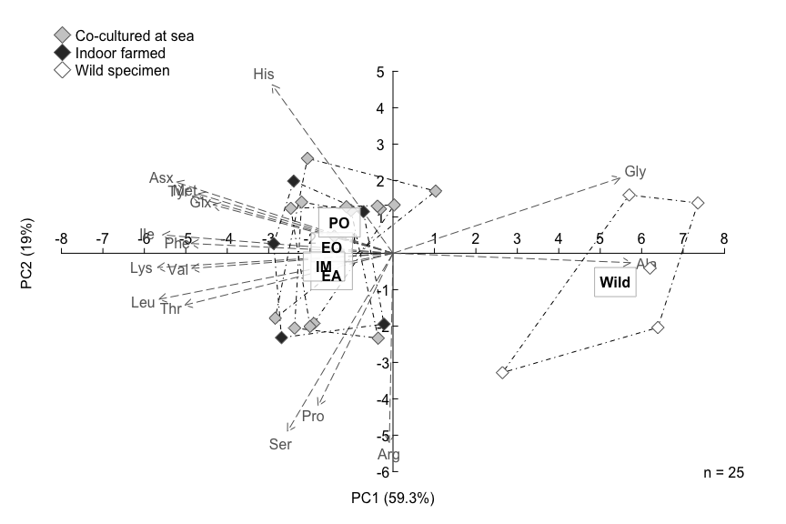
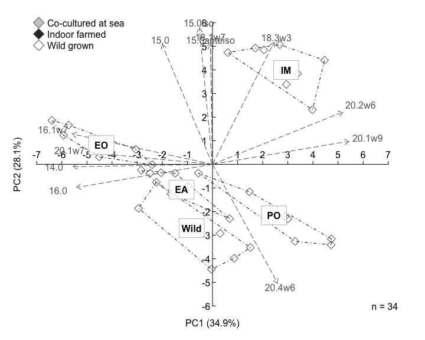
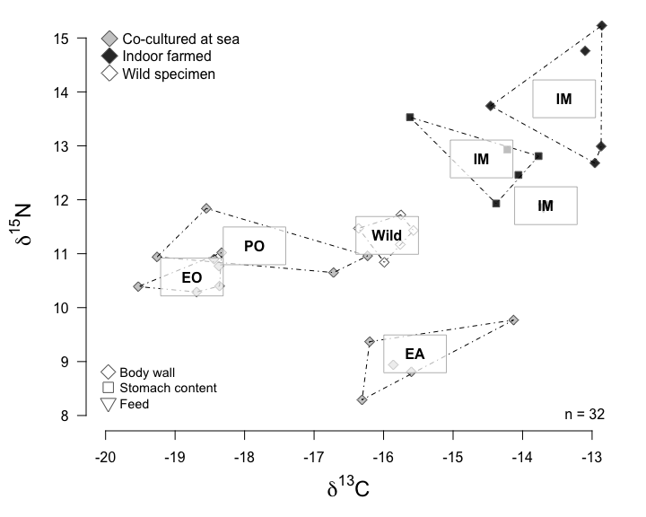

### R Markdown

This R Markdown document is made to support the findings of the paper "Survival and growth of juvenile sea cucumbers Holothuria forskali in co-culture with shellfish implying low artificial workload for producers in Brittany (France)" by David et al. (2024).

Preparing the toolbox
---------------------

Let's begin by loading the libraries that we will require to run the analyses.

``` r
library(agricolae)
library(vegan)
library(ade4)
library(factoextra)
```

Loading the data
----------------

We load growth, pigments, amino acid, fatty acid and stable isotope data from the GitHub server.

For details on line and column headings please check the readme file.

``` r
growth <- read.csv("https://raw.githubusercontent.com/DAVID-Fk/Sea-cucumber-juveniles/main/GrowthHoloFarm.csv", sep=",", header=T)
AA <- read.csv("https://raw.githubusercontent.com/DAVID-Fk/Sea-cucumber-juveniles/main/AAHoloFarm.csv", sep=",", header=T)
FA <- read.csv("https://raw.githubusercontent.com/DAVID-Fk/Sea-cucumber-juveniles/main/FAHoloFarm.csv", sep=",", header=T)
pig <- read.csv("https://raw.githubusercontent.com/DAVID-Fk/Sea-cucumber-juveniles/main/PigHoloFarm.csv", sep=",", header=T)
SI <- read.csv("https://raw.githubusercontent.com/DAVID-Fk/Sea-cucumber-juveniles/main/SIHoloFarm.csv", sep=",", header=T)
```

Growth and survival
===================

``` r
# Mean weight and standard deviation

tapply(growth$Idweight, paste(growth$Origin, growth$Time), mean)
```

    ##         AQUA-B J0       AQUA-B J125          Brest J0        Brest J178 
    ##         0.3266667        10.2772277         6.6744444        35.3111111 
    ##        Cancale J0      Cancale J133   Plouguerneau J0 Plouguerneau J133 
    ##         7.4937037        10.3375000         6.2401250         9.0607143 
    ## Plouguerneau J281 
    ##        33.2337838

``` r
tapply(growth$Idweight, paste(growth$Origin, growth$Time), sd)
```

    ##         AQUA-B J0       AQUA-B J125          Brest J0        Brest J178 
    ##        0.04041452        6.27463188        1.23301268        6.60578079 
    ##        Cancale J0      Cancale J133   Plouguerneau J0 Plouguerneau J133 
    ##        1.33384355        3.06079228        1.03547885        2.75698967 
    ## Plouguerneau J281 
    ##        7.05105213

``` r
# Specific growth rates calculation

SGRplo1=log(mean(growth$Idweight[growth$Origin=="Plouguerneau" & growth$Time=="J133"])/mean(growth$Idweight[growth$Origin=="Plouguerneau" & growth$Time=="J0"]))*100/133

SGRplo2=(log(mean(growth$Idweight[growth$Origin=="Plouguerneau" & growth$Time=="J281"]))-log(mean(growth$Idweight[growth$Origin=="Plouguerneau" & growth$Time=="J133"])))*100/(281-133)

SGRbre=(log(mean(growth$Idweight[growth$Origin=="Brest" & growth$Time=="J178"]))-log(mean(growth$Idweight[growth$Origin=="Brest" & growth$Time=="J0"])))*100/178

SGRcan=(log(mean(growth$Idweight[growth$Origin=="Cancale" & growth$Time=="J133"]))-log(mean(growth$Idweight[growth$Origin=="Cancale" & growth$Time=="J0"])))*100/133

SGRAqB=(log(mean(growth$Idweight[growth$Origin=="AQUA-B" & growth$Time=="J125"]))-log(mean(growth$Idweight[growth$Origin=="AQUA-B" & growth$Time=="J0"])))*100/125
```

Pigments
========

Total pigments description
--------------------------

``` r
# Concentration of pigments per mg of dry stomach content

pigconc=pig[,-c(1:4)]*pig$solventVol/pig$splMass
rownames(pigconc)=pig[,1]

# Mean total sum of pigments and standard deviation

totpig=rowSums(pigconc)
tapply(totpig, pig$condition, mean)
```

    ##      1-EA      2-EO      3-PO      4-IM 5-IM food 
    ## 25.396815  2.843854  1.783240 68.159811 19.194994

``` r
tapply(totpig, pig$condition, sd)
```

    ##       1-EA       2-EO       3-PO       4-IM  5-IM food 
    ## 12.8901903  0.3767946  0.5174520 24.5875214  3.1175125

``` r
# Statistical comparisons between treatments

waerden.test(totpig[-c(1:2)], pig$condition[-c(1:2)], console=T)
```

    ## 
    ## Study: totpig[-c(1:2)] ~ pig$condition[-c(1:2)]
    ## Van der Waerden (Normal Scores) test's
    ## 
    ## Value : 19.98215
    ## Pvalue: 0.0001711947
    ## Degrees of Freedom:  3 
    ## 
    ## pig$condition[-c(1:2)],  means of the normal score
    ## 
    ##      totpig..c.1.2..       std r
    ## 1-EA       0.1445689 0.2838820 7
    ## 2-EO      -0.4347858 0.1651588 3
    ## 3-PO      -1.0753353 0.4314144 7
    ## 4-IM       0.9774653 0.4859613 8
    ## 
    ## Post Hoc Analysis
    ## 
    ## Groups according to probability of treatment differences and alpha level( 0.05 )
    ## 
    ## Treatments with the same letter are not significantly different.
    ## 
    ## Means of the normal score
    ## 
    ##           score groups
    ## 4-IM  0.9774653      a
    ## 1-EA  0.1445689      b
    ## 2-EO -0.4347858      c
    ## 3-PO -1.0753353      d

Total pigments visualisation
----------------------------



Summary of pigments table
-------------------------

``` r
# Let's group main pigments and their derivatives

pigconc2=cbind(pigconc[,2], rowSums(pigconc[,c(1,3,4)]), pigconc[,c(5:7)], rowSums(pigconc[,c(8:9)]), pigconc[,c(10:11)], rowSums(pigconc[,c(12:16)]), rowSums(pigconc[,c(17:20)]), rowSums(pigconc[,c(21:23)]), rowSums(pigconc[,c(24:25)]))
names(pigconc2)=c("Fuco", "Fuco like", "Diadino", "Diato", "Lutein", "Zeax", "Cantha", "Chloro-b", "B-car", "Pheopb-a", "Chloro-a", "Pheopt-a")

# Let's edit a summary table

summaryPIG=data.frame(M=aggregate(cbind(pigconc2, totpig), by=list(pig$condition), mean), SD=aggregate(cbind(pigconc2, totpig), by=list(pig$condition), sd), LENGTH=aggregate(cbind(pigconc2, totpig), by=list(pig$condition), length))
```

Principal component analysis on pigment compositions of stomach contents
------------------------------------------------------------------------



Note that the figure was further modified with a vectorial graphics editor to avoid labels superposition

Total fatty acids and total amino acids
=======================================

Means and standard deviations
-----------------------------

``` r
# Let's define grouping factors

AAcond=as.factor(substring(AA[,1], 8, nchar(AA[,1])))
AAcond=factor(AAcond, levels=c("EA","EO","PO","IM", "Wild"))
FAcond=as.factor(substring(FA[,1], 8, nchar(FA[,1])))
FAcond=factor(FAcond, levels=c("EA","EO","PO","IM", "IMF", "Wild"))
  
# Absolute fatty acid concentrations

FAconc=FA[,-c(1:3, which(colnames(FA)=="C23.0"))]/FA[,which(colnames(FA)=="C23.0")]*FA[,which(colnames(FA)=="StdC23")]/FA[,which(colnames(FA)=="splMass")]
totFA=rowSums(FAconc, na.rm=T)
  
rownames(FAconc)=FA[,1]

# Let's evidence statistical differences on total AA and total FA

waerden.test(AA$PrProt, AAcond, console=T)
```

    ## 
    ## Study: AA$PrProt ~ AAcond
    ## Van der Waerden (Normal Scores) test's
    ## 
    ## Value : 18.93663
    ## Pvalue: 0.0008087988
    ## Degrees of Freedom:  4 
    ## 
    ## AAcond,  means of the normal score
    ## 
    ##         AA.PrProt       std r
    ## EA    0.008096704 0.4807686 5
    ## EO    0.080539828 0.3807157 5
    ## IM   -0.115634987 0.6194758 5
    ## PO   -1.231053996 0.3950558 5
    ## Wild  1.258052451 0.3553443 5
    ## 
    ## Post Hoc Analysis
    ## 
    ## Alpha: 0.05 ; DF Error: 20 
    ## 
    ## Minimum Significant Difference: 0.6023117 
    ## 
    ## Treatments with the same letter are not significantly different.
    ## 
    ## Means of the normal score
    ## 
    ##             score groups
    ## Wild  1.258052451      a
    ## EO    0.080539828      b
    ## EA    0.008096704      b
    ## IM   -0.115634987      b
    ## PO   -1.231053996      c

``` r
waerden.test(totFA[-which(FAcond=="IMF")], FAcond[-which(FAcond=="IMF")], console=T)
```

    ## 
    ## Study: totFA[-which(FAcond == "IMF")] ~ FAcond[-which(FAcond == "IMF")]
    ## Van der Waerden (Normal Scores) test's
    ## 
    ## Value : 20.97475
    ## Pvalue: 0.000320341
    ## Degrees of Freedom:  4 
    ## 
    ## FAcond[-which(FAcond == "IMF")],  means of the normal score
    ## 
    ##      totFA..which.FAcond.....IMF...       std r
    ## EA                       0.85087163 0.5341458 7
    ## EO                       0.55111348 0.8542521 6
    ## IM                       0.09526856 0.3382648 8
    ## PO                      -0.31222735 0.7432921 7
    ## Wild                    -1.30655655 0.3947079 6
    ## 
    ## Post Hoc Analysis
    ## 
    ## Groups according to probability of treatment differences and alpha level( 0.05 )
    ## 
    ## Treatments with the same letter are not significantly different.
    ## 
    ## Means of the normal score
    ## 
    ##            score groups
    ## EA    0.85087163      a
    ## EO    0.55111348     ab
    ## IM    0.09526856     bc
    ## PO   -0.31222735      c
    ## Wild -1.30655655      d

Graphical representation
------------------------



Amino acids
===========

Summary table
-------------

``` r
# Let's group essential amino acids

EAA=rowSums(AA[, c(which(colnames(AA)=="His"), which(colnames(AA)=="Ile"), which(colnames(AA)=="Leu"), which(colnames(AA)=="Lys"), which(colnames(AA)=="Met"), which(colnames(AA)=="Phe"), which(colnames(AA)=="Thr"), which(colnames(AA)=="Val"))])

# Let's edit a summary table

summaryAA=data.frame(M=aggregate(cbind(AA[,-c(1:3)], EAA, AA$PrProt), by=list(AAcond), mean), SD=aggregate(cbind(AA[,-c(1:3)], EAA, AA$PrProt), by=list(AAcond), sd), LENGTH=aggregate(cbind(AA[,-c(1:3)], EAA, AA$PrProt), by=list(AAcond), length))
```

Principal component analysis on amino acid compositions of body wall
--------------------------------------------------------------------



Note that the figure was further modified with a vectorial graphics editor to avoid labels superposition

Fatty acids
===========

Summary Table
-------------

``` r
# Let's convert absolute concentrations to relative abundances

FAprct=FAconc/rowSums(FAconc, na.rm=T)*100
FAprct[is.na(FAprct)]=0


# Let's define categories of FA
  
brFA=rowSums(FAprct[, c(which(colnames(FAprct)=="C15.0iso"), which(colnames(FAprct)=="C15.0anteiso"), which(colnames(FAprct)=="C16.0iso"))])
SFA=rowSums(FAprct[, c(which(colnames(FAprct)=="C14.0"), which(colnames(FAprct)=="C15.0"), which(colnames(FAprct)=="C16.0"), which(colnames(FAprct)=="C18.0"), which(colnames(FAprct)=="C19.0"),which(colnames(FAprct)=="C20.0"), which(colnames(FAprct)=="C21.0"), which(colnames(FAprct)=="C22.0"), which(colnames(FAprct)=="C24.0"))])
PUFA=rowSums(FAprct[, c(which(colnames(FAprct)=="C18.2w6"), which(colnames(FAprct)=="C18.3w3"), which(colnames(FAprct)=="C18.4w3"), which(colnames(FAprct)=="C20.2w6"), which(colnames(FAprct)=="C20.4w6"), which(colnames(FAprct)=="C20.5w3"), which(colnames(FAprct)=="C22.5w6"), which(colnames(FAprct)=="C22.6w3"))])
HUFA=rowSums(FAprct[, c(which(colnames(FAprct)=="C20.4w6"), which(colnames(FAprct)=="C20.5w3"), which(colnames(FAprct)=="C22.5w6"), which(colnames(FAprct)=="C22.6w3"))])
w3=rowSums(FAprct[, c(which(colnames(FAprct)=="C18.3w3"), which(colnames(FAprct)=="C18.4w3"), which(colnames(FAprct)=="C20.5w3"), which(colnames(FAprct)=="C22.6w3"))])
w6=rowSums(FAprct[, c(which(colnames(FAprct)=="C18.2w6"), which(colnames(FAprct)=="C20.2w6"), which(colnames(FAprct)=="C20.4w6"), which(colnames(FAprct)=="C22.5w6"))], na.rm=T)
LCMUFA=rowSums(FAprct[, c(which(colnames(FAprct)=="C20.1w9"), which(colnames(FAprct)=="C20.1w7"), which(colnames(FAprct)=="C22.1w11"), which(colnames(FAprct)=="C22.1w9"), which(colnames(FAprct)=="C23.1w9"), which(colnames(FAprct)=="C24.1w9"))])
MUFA=rowSums(FAprct[, c(which(colnames(FAprct)=="C16.1w7"), which(colnames(FAprct)=="C18.1w9"), which(colnames(FAprct)=="C18.1w7"), which(colnames(FAprct)=="C20.1w9"), which(colnames(FAprct)=="C20.1w7"), which(colnames(FAprct)=="C22.1w11"), which(colnames(FAprct)=="C22.1w9"), which(colnames(FAprct)=="C23.1w9"), which(colnames(FAprct)=="C24.1w9"))])

# Let's edit a summary table

summaryFA=data.frame(M=aggregate(cbind(FAprct, brFA, SFA, MUFA, LCMUFA, PUFA, HUFA, w3, w6, totFA) , by=list(FAcond), mean), SD=aggregate(cbind(FAprct, brFA, SFA, MUFA, LCMUFA, PUFA, HUFA, w3, w6, totFA), by=list(FAcond),sd), LE=aggregate(cbind(FAprct, brFA, SFA, MUFA, LCMUFA, PUFA, HUFA, w3, w6, totFA), by=list(FAcond),length))
```

Principal component analysis on fatty acid compositions of body wall
--------------------------------------------------------------------



Note that the figure was further modified with a vectorial graphics editor to avoid labels superposition

Stable isotopes
===============

``` r
# Let's identify grouping factors

tissue=as.factor(substring(SI[,1], 1, 2))
condition=as.factor(substring(SI[,1], 8, nchar(SI[,1])))

# Let's calculate mean values and standard deviations for d13C

tapply(SI$d13C, paste(tissue, condition), mean)
```

    ##   Al IM   BW EA   BW EO   BW IM   BW PO BW Wild   SC IM 
    ## -13.665 -15.620 -18.656 -13.250 -17.840 -15.886 -14.410

``` r
tapply(SI$d13C, paste(tissue, condition), sd)
```

    ##      Al IM      BW EA      BW EO      BW IM      BW PO    BW Wild      SC IM 
    ## 0.04949747 0.87900512 0.51007843 0.68322763 1.29682304 0.30402303 0.71295161

``` r
# Let's calculate mean values and standard deviations for d15N

tapply(SI$d15N, paste(tissue, condition), mean)
```

    ##   Al IM   BW EA   BW EO   BW IM   BW PO BW Wild   SC IM 
    ##  11.890   9.036  10.574  13.880  11.058  11.326  12.732

``` r
tapply(SI$d15N, paste(tissue, condition), sd)
```

    ##      Al IM      BW EA      BW EO      BW IM      BW PO    BW Wild      SC IM 
    ## 0.02828427 0.56283212 0.30907928 1.10097684 0.45455473 0.33440993 0.59145583

Graphical representation (biplot 13C-15N)
-----------------------------------------


